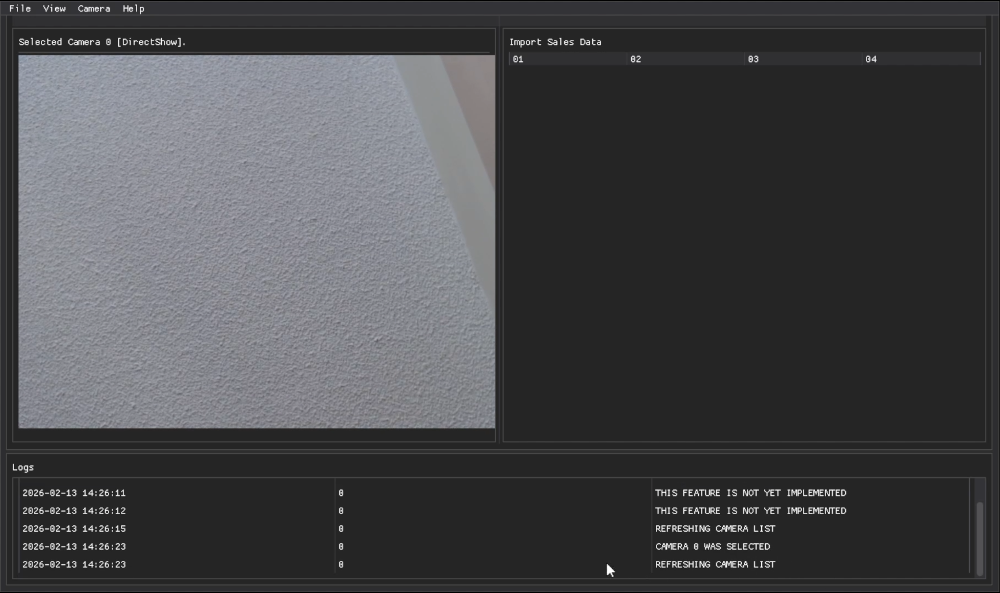
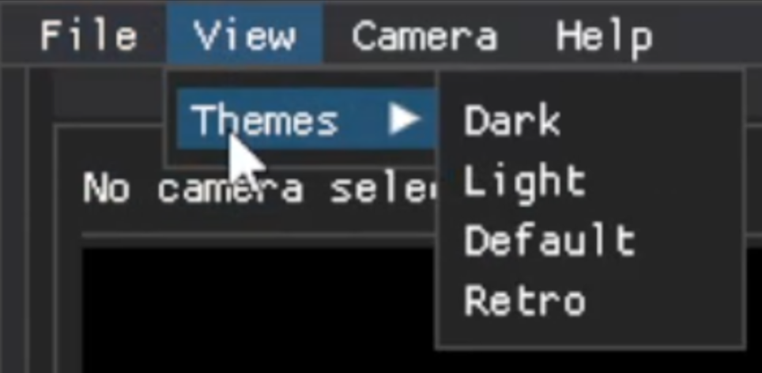
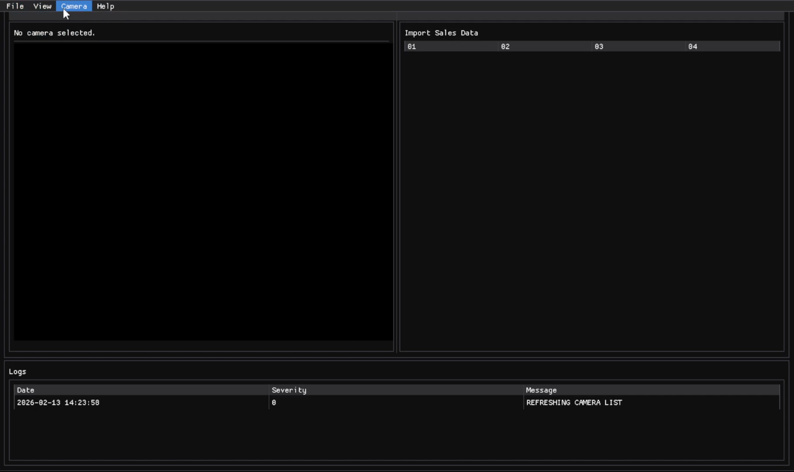
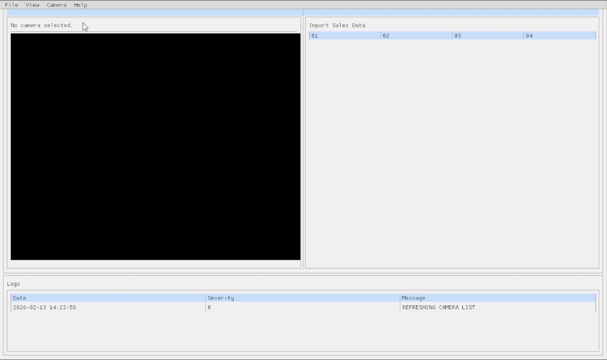
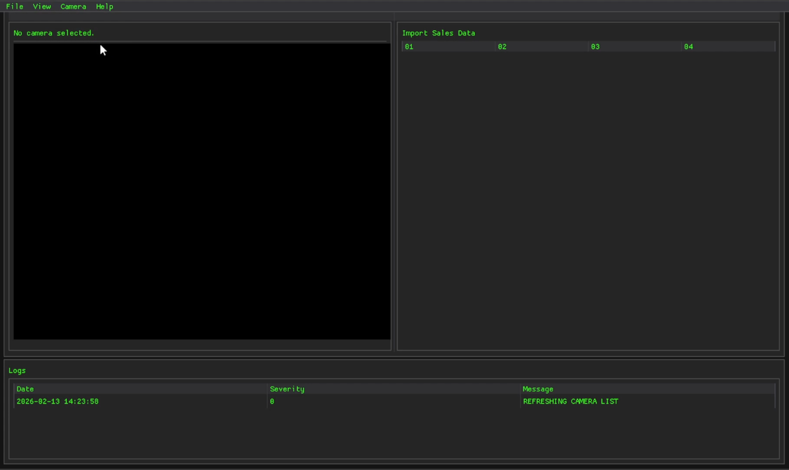
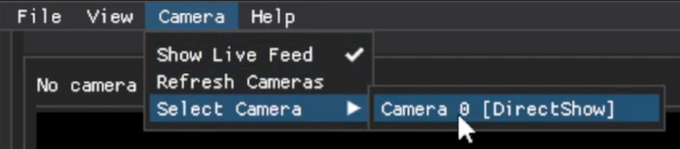
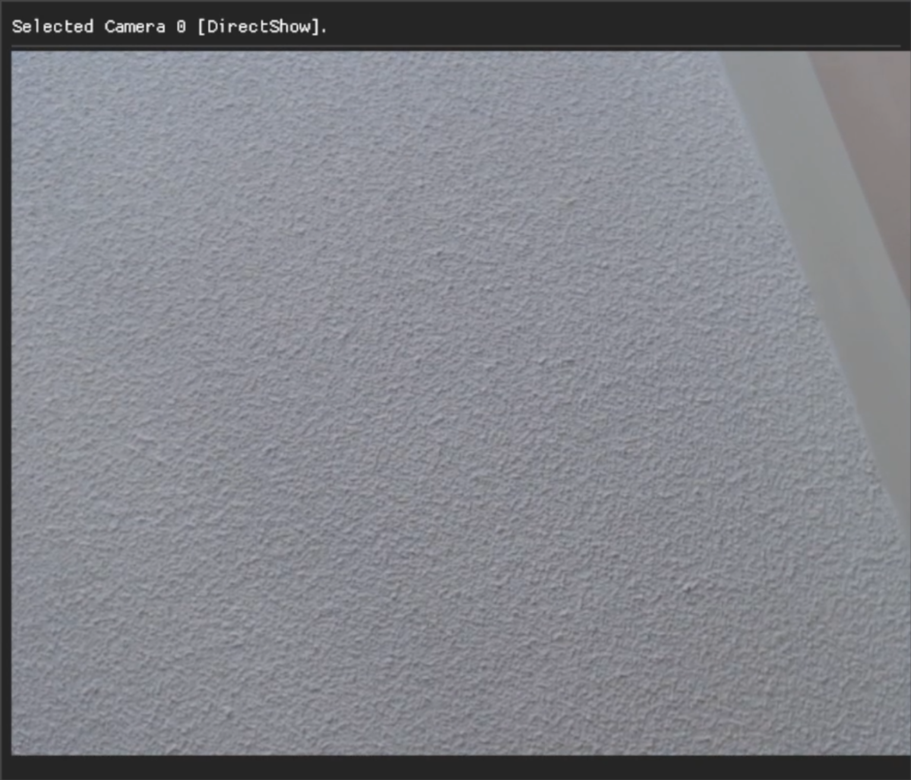
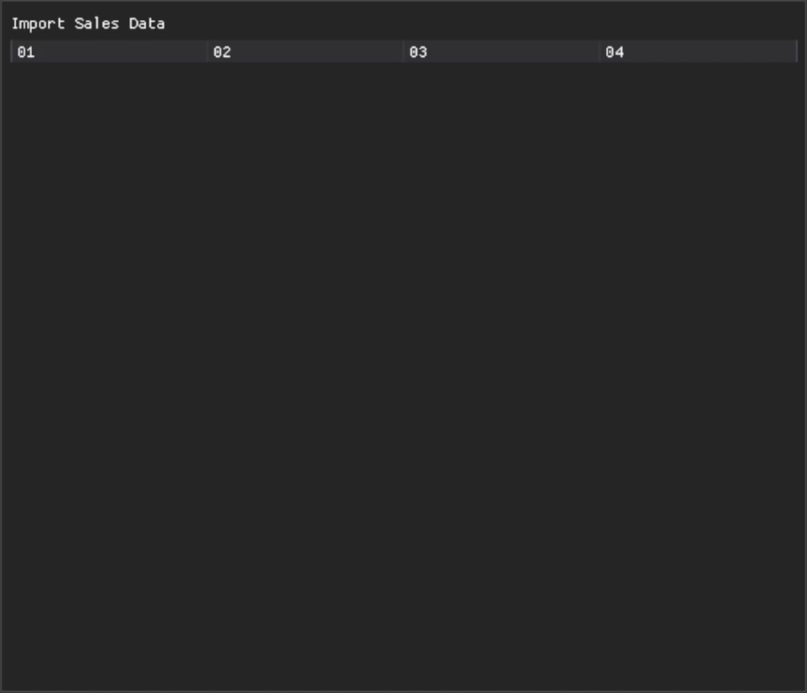
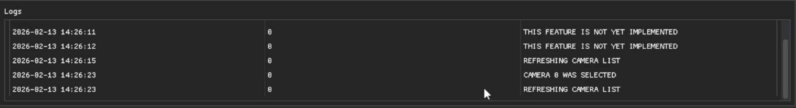

# StoreFlow Analytics ITR1

StoreFlow Analytics is an early-stage system designed to help retail store owners understand in-store activity by combining camera input with sales data.
Iteration 1 focuses on building the project foundation: core domain structure, a stub database, and a working GUI to demonstrate the first set of features.

This version is not a complete analytics system yet, it establishes the infrastructure required for integrating tracking and analysis in later iterations.

###### Default Theme

## Features

### Menu Bar
- Displaying *File, View, Camera,* and *Help*
    - *File* tab features not yet implemented
    - *Help* features not yet implemented

    - *View* features include a theme selection of Dark, Light, Default, and Retro

#### Dark Theme

#### Light Theme

#### Retro Theme

    - *Camera* features include an option to toggle live feed on and off, an option to refresh cameras, and an option to select a camera

### Displayed Windows
- Live feed window displaying selected camera

- Imported sales data window 

    - Sales database not yet integrated

- System log window displaying runtime messages (Camera refresh, feature status, etc)

## Tech Stack

### GUI Framework
-   **Dear PyGui**: Used to implement the desktop graphical user interface, including the live feed panel, menus, logging window, and theme switching.

### Development Environment
-   **Visual Studio Code**: Used for development, debugging, and project management.

## Future Enhancements

-   **File Tab**: Allow user to export data analytics and traced camera footage.
-   **Help Tab**: Allow users to view catalogue of troubleshooting tips.
-   **Person and Path Tracking**: Monitor customer movement and behaviour through camera footage.
-   **Mock Database Integations**: Integrated sales database within the program.